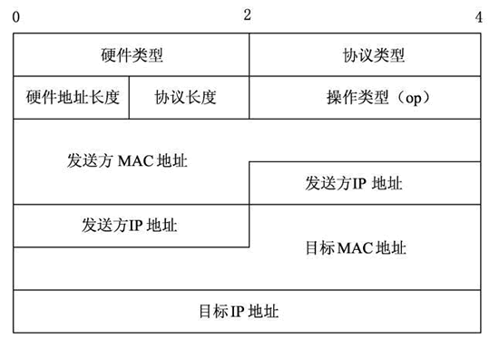
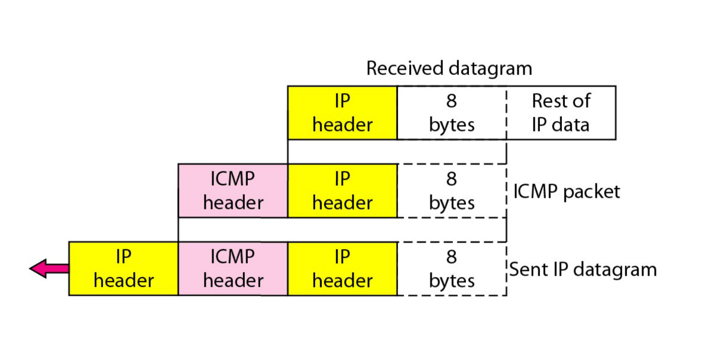

# Chapter 19 逻辑寻址

哈哈, 全加粗了.

## IPv4地址

常识性的东西就不说了.

### 地址分类

ABCDE五类地址

重点在ABC类上.

#### A类地址

A类地址网络号只有前8位, 其中第一位必须是0.

网络号全0表示本网络, 是预留的.

网络号后七位全1用于本地环回测试, 也是预留的.

**所以A类地址有 $$ 2^{7} - 2$$ 个网络**

主机号是后面24位.

主机号全0表示网络号指定的该网络, 预留.

主机号全1表示广播, 预留.

**所以A类地址一个网络最多有 $$ 2^{24} - 2$$ 个主机**

#### B类地址

网络号有前面16位, 其中前两位必须是10.

网络号128.0是不指派, 最少也得是128.1

**所以B类地址有 $$ 2^{14} - 1$$ 个网络**

类似的, **B类地址一个网络最多有 $$ 2^{16} - 2$$ 个主机**

#### C类地址

与B类地址类似:

**C类地址有 $$2^{21}-1$$ 个网络, 最多$$2^{8}-1$$ 个主机**

### 几类特殊的地址

#### 网络地址

就是主机号全为0, 只能用来标识网络, 不能分配给主机

#### 直接广播地址

网络号+全1的主机号, 只能用来当目的地址, 在这个网络上的所有设备都将接受处理.

#### 受限广播地址

就是255.255.255.255, 只能当目的地址. 

这个网络的所有设备都要收.

不是整个英特网, 路由器会屏蔽这个包.

是一个**E**类地址

#### 这个网络中的这个主机

就是0.0.0.0, 在主机第一次加入网络的时候问ip用.

是一个**A**类地址

#### 这个网络的特定主机

就是网络号全0+主机号

是一个**A**类地址

#### 环回地址

网络号是127, 主机号随意.

是一个**A**类地址

## NAT

NAT可以解决ip地址不够用的问题.

其实就是一个NAT服务器后面罩着一群小东西, 小东西用一个端口发的数据包到了NAT服务器就变成了NAT的另一个端口发的. 

然后NAT服务器会记录下来这个对应关系, 收到对应的数据包再按照NAT表发回去.

如果从外面收到NAT表里面没有的数据包, 那就把他给扔了.

## 子网划分

### 子网

网络号+主机号不合理, 借用主机号的几位区别子网.

划分子网纯属网络单位内部的事情, 在外面看他还是一个网络.

### 子网掩码

子网掩码标识网络地址.

子网掩码与IP地址按位与结果就是他的网络地址, 只有子网掩码按位与之后相等的两个IP地址, 才在一个子网里.

### 划分子网的方法

#### 直接按类

ABC类+子网划分, 不太好吧

#### CIDR

无分类编址.

就是没有ABC类之分, 一切都靠子网掩码.

IP地址化成两部分: **网络前缀; 主机号**

用斜线记法: ip地址/掩码1的长度

就是前多少位是前缀, 掩码长度就多少

##### 路由聚合/超网

就是几个前几位相同的地址块, 可以合在一起用一个CIDR地址块包含起来, 就是看最长公共前缀.

## IPv6地址

128位, 16字节, 32个数, 8段.

### 缩短

每段开头有连续的0, 可以省去, 但是一段至少有一位.

如果有连续的全0段, 可以用一个**::**表示.

但是一个地址里最多只能出现一个**::**

# Chapter 20 IP协议

## IP数据包的格式

一个一个说

1. 版本: 4bits, 说明IP数据报用的IPv4还是v6
2. 首部长度: 4bits, ipv4数据报首部最大60字节, 一般都是20字节, 这个0-15的数字*4就是字节数. **单位是4字节**
3. 服务类型: 8bits, 没人用过.
4. 总长度: 就是包括头部的, 整个IP数据报的长度, 最长65535B(具体多长限制于MTU) **单位是1字节**
5. 标识: 是一个计数器, 用来产生数据包的标识
6. 标志: 前两位是MF/DF, 第三位没人用, 分片用的.
7. 片漂移: 分片用的 **单位是8字节**
8. 生存时间(TTL): 到一个路由器就-1, 为0就给他扔了, 防止他转圈.
9. 协议: 标明这个数据报应该交给什么协议处理.
10. 首部校验和: 用一个更简单的方式, **只检查首部是否有错**.
11. 源地址
12. 目的地址

## 分段

### MTU

Maximum Transmission Unit, **链路层**的一个属性.

就是一个帧里面他能装的最大数据字节数, 不包括链路层的头.

也就是说一个IP数据报长度不能超过他的下层链路层的MTU.

以太网的MTU是1500

所以数据一大肯定是要分段的

### 标志位MF

More Frames: 指示后面是不是还有这一帧被分出来的续帧.

也就是一个长达14800B的数据被做成了ip数据报, 长度15020, MF=0;

但是中间遇到了以太网, 看门的路由器就会把他分成10段, 每段1480B, 加上头正好1500B.

这十个数据报里面, 前九个的MF都是1, 只有最后的MF=0;

## IPv6数据报格式

好, 除了版本都不一样.

拓展首部是算在载荷里的.

1. 版本: 4bits, 就是v4或者v6

2. 通信量类, 8bits, 是一种优先级. 优先级中有两类, 前8个优先级可以被拥塞控制, 后8个不能被拥塞控制.

3. 流标号, 20bits, 好像有一些神奇的用途, 视频和语音的传输之类的.

4. 有效载荷长度: 16bits, 拓展首部+数据的长度, 最长能表示64KB.

5. 下一个首部, 8bits, 协议字段或者类似链表指向下一个可选字段

6. 跳数限制, 8bits, 类似TTL

7. 源地址, 128bits.

8. 目的地址, 128bits.

   

## IPv4和IPv6混合

三种技术:

1. 双协议栈

2. 头部转换

3. 隧道

   

# Chapter 21 地址映射 差错报告 多播

## ARP

### 作用

一个主机在给另一个主机发IP数据报, 他知道对面的IP, 做好了IP数据报. 问题是链路层需要知道他的MAC地址. 

这就是ARP的作用, 用一个IP就能拿到对应的MAC地址.

### 方法

就是这个主机先**广播**一个ARP数据报, 说明自己想要谁的MAC地址.

然后这个主机收到之后, 就会**单播**一个ARP数据报, 告诉他自己的MAC地址.

如果要发送给的主机和自己不在一个子网, 发送方就先找路由器的MAC地址.

### 数据报格式

1. 硬件类型, 以太网都是1.
2. 协议类型, IP协议都是0800H
3. 硬件地址长度, MAC地址都是6
4. 协议(地址)长度, IPv4都是4
5. 操作类型, 请求是1, 回复是2

请求的时候, 目标MAC地址全0

### 封装

ARP是三层协议, 还是要经过链路层的封装.

封装的时候, 发送时目的MAC地址是广播地址, 全1.

## DHCP

好像不太考, 只要知道他分ip的就行了

## ICMP

ICMP报文有两种:

1. 差错报告报文
2. 询问报文

### 差错报告报文

1. 终点不可达: 路由器或者主机不能交付数据报.
2. 源站抑制: 拥塞而丢弃数据报.
3. 时间超过: TTL为0, 或者终点在规定时间内不能收到数据报的全部报片.
4. 参数问题: 数据报首部有不正确的值. (现在一般不发了)
5. 改变路由: 仅由路由器发送, 让主机知道下一次应该发给其他路由(更好的路由).

#### 不应发送差错报告报文的情况

1. 对ICMP差错报文不应再发一次.
2. 对不是第一个的分片数据报不发
3. 对具有组播地址的数据报不发
4. 特殊地址(127.0.0.0或者0.0.0.0)不发

### 询问报文

我感觉这个分类不重要

### 差错报文格式

ICMP虽然是网络层协议, 但是ICMP报文还是要当成IP数据报的内容, 前面加个IP头送给链路层.

ICMP的差错报文包括了ICMP头, 还有出错了的数据报的IP头, 和那个IP数据报的数据的前8字节(包括了传输层的端口号)

**所以ICMP封装好的报文实际上有两个IP头, 一个是他应该有的IP头, 还有出错了的IP头**

## IGMP

好像不太重要.

控制网络中加入离开之类的东西.

跟ICMP一样, 装在IP数据报里发出去.

IGMP的IP数据报的TTL一定为1.

