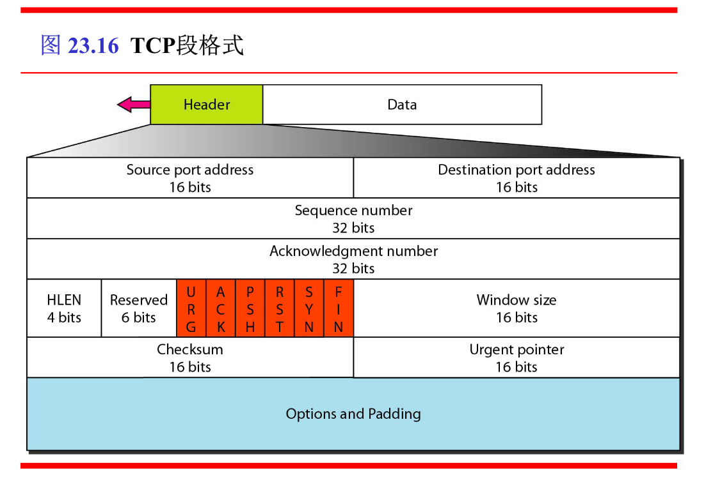

现在是6月22日下午15:38, 学不完了

期末速成计网这种层次感分明的东西有种爬天梯的感觉.

# Chapter 23/24 UDP,TCP和SCTP/拥塞控制和服务质量 

传输层概述(自己编的):

传输层提供的是端到端的逻辑通信, 一台主机上的所有进程**复用**同一个IP层. 数据到了传输层, 就会被**分用**到不同的应用程序上.

传输层所有功能:

1. 应用进程的逻辑通信
2. 差错检测
3. 无连接或者面向连接的服务
   1. 无连接
   2. 面向连接
      1. 连接管理(三次握手)
      2. 流量控制/拥塞控制
4. 复用/分用

我们经常说传输层是可靠的, 但是传输层的UDP并不提供可靠性, 所以说传输层是可靠的是面对TCP来说的. 实际上每一层都有可靠和不可靠的协议, 单独直接说某一层可靠或者不可靠是笼统的. 例如在几十年前人们都说链路层就已经是可靠的了, 是因为那时候链路层普遍使用了HDLC协议. 现在由于网络质量改善, 链路层普遍使用了不可靠的PPP协议, 我们又说链路层是不可靠的了. 同样, 有无连接也是这样的, 现在我们说网络层无连接, TCP才提供了连接, 是因为IP协议是无连接的, 之前的X.25之类有连接的网络层协议被淘汰了而已.

马上就要考试了这么多没学我还在这写这些东西, 迟早要挂.

## 熟知的端口号

常识

1. FTP: 20(数据),21(控制)
2. Telnet: 23
3. SMTP: 25
4. DNS: 53
5. TFTP: 69
6. HTTP: 80
7. SNMP: 161

## 套接字

套接字就是IP+端口号.

## UDP

常识就不多说了.

### UDP校验

UDP的头只记录了源端口, 目的端口, 和数据的长度(包括头部).

在检验的时候, 需要加一个12B的伪头部一起校验, 但是这终究还是个伪头部, 不会被发出去.

伪头部里包含了源IP和目的IP, 还有一些奇怪的东西.

校验就是把从首部到数据结束的所有东西两个字节两个字节加在一起, 如果数据不是偶数就要补一个0字节.

注意, 校验过程中遇到的校验位按照0算.

算出来一个2B的东西, 取反就是校验位.

验证的时候把校验位和所有东西加在一起, 如果结果是全1, 就说明数据没大问题.

## TCP

### 段格式

我服了, 这nm全要背.

1. 懒得解释了
2. 懒得解释了
3. 序号, 就是Seq, 现在要发的第一个字节的编号. 注意TCP是给字节编号, 所以如果这个TCP发了100B数据, Seq=701, 下一个TCP的Seq=801
4. 确认号, 字节编号, 是累积确认, 是期望得到的下一个字节的编号.
5. 数据偏移, 其实就是头部的长度, 跟IP首部长度一样, 单位是4B. 注意这个跟IP分段的那个数据偏移不一样.
6. 保留字段,  现在没用.
7. 紧急URG, 表示这个TCP包比较急, 从开始到紧急指针指向的地方这部分数据不进缓冲区直接发出去吧, 剩下的数据还是要进缓冲区的.
8. 确认ACK, ACK=1的时候确认号才有用. 一旦TCP建立了, ACK必须都要为1.
9. 推送PSH, 这个数据也急, 但是不完全急, 要进缓冲区, 但是进了缓冲区就赶紧交付给上层, 不要等缓冲区满了再交付.
10. 复位RST, RST=1的时候, 表示出了大问题, 要把TCP断掉重连.
11. 同步SYN, 建立连接用的.
12. 终止FIN, 终止连接标志.
13. 窗口字段, 表示接收方现在还有多少接收缓存.
14. 校验和, 和UDP一样, 计算的时候要加假头(假头的内容和UDP有一个东西不一样, 要把17改成6)
15. 紧急指针, 就是开始到这里的数据都是紧急数据, 在URG里面提到过.
16. 选项字段, 长度可变.
17. 填充字段, 要把整个首部填成4B的整数倍.

### TCP连接建立

经典三次握手.

1. 发送方发, SYN = 1, Seq = x. 这时不能带数据.
2. 服务器发, SYN = 1, Seq = y, ACK = x+1. 这时也不能带数据.
3. 发送方发, SYN = 0, Seq = x+1, ACK = y+1. 可以带数据发了.

**只有最后一个段能带数据发, 但是所有的段都占用了编号**

### TCP连接拆除

经典四次挥手.

1. 要关闭连接的一方A发, FIN = 1, Seq = u.
2. B发, ACK = u+1, Seq = v. 这时候B有可能还有数据要发, B会接着发, A这时候也要接着收, 但是A不会再发东西了.
3. B数据发完了, 发FIN=1, Seq = w, ACK = u+1. B到了LAST-ACK.
4. A发, ACK = w+1, Seq = u+1.

**FIN只有第一次和第三次为1**

### TCP可靠传输机制

#### 序号

TCP每次建立连接的时候, 都要选择一个不同的初始序号.

#### 重传

首先, 发送方会动态估计RTT.

$$RTT = (1-\alpha)\times 旧RTT + \alpha \times 新RTT$$

然后, 超时重传时间$$RTO = \beta \times RTT$$

这个方法只有在TCP有用, UDP没有重传, 所以不需要.

即使链路层是完美的, 这些可靠传输机制也是必要的. 数据报可能会因经过的路由不同而失序, 或者路由错误计算导致TTL减到0, 或者中间某个路由器缓存炸了.

### TCP流量控制

#### 滑动窗口

 发送方和接收方都维护了一个滑动窗口, 长度在连接过程中会协商.

这个窗口和之前ARQ的窗口差不多, 注意就是发送方和接收方的窗口大小都是不固定的. 而且TCP的序号没有限制, 所以不会出现特别奇怪的问题.

#### 超时

TCP为每个发送的报文段设置单独的计时器, 计时器超过RTO的时还没收到ACK就会重发.

#### 快速重传

如果发送方连续接收到三次同一个ACK, 就知道那个数据肯定出事了, 就会直接重传那一个. 不用等到超时.

#### 零窗口

接收方返回的ACK里面包含了接收方的缓存还有多大, 如果接收方不想收了, 或者收不了了, 可以返回一个带有rwnd=0的ACK, 这样发送方就会暂停发送. 等到接收方想收了, 它可以再发一个东西通知他继续发. 并且发送方还会每隔一段时间发一个试探性的包来询问接收窗口.

## TCP拥塞控制

流量控制只是两端的问题, 格局小了.

拥塞控制是为了整个网络着想, 格局很大.

### rwnd和cwnd

rwnd是接收端窗口, 与接收端缓存大小有关.

cwnd是拥塞窗口, 与发送方对网络情况的估计有关.

发送端真正的窗口大小应该是两个窗口的最小值.

### 慢启动算法

在刚开始, 发送方将cwnd设为1, 就是一个MSS的大小.

然后每次收到一个ACK之后, cwnd都会+1.

这样看起来增长的很慢, 实际上cwnd+1之后, 每次发送的数据也会变多, 收到的ACK也会变多, 所以cwnd实际上是指数级增长的.

### 拥塞避免算法

为了阻止cwnd指数增长, 在TCP开始之前, 需要一个慢启动门限ssthresh.

在cwnd小于等于ssthresh时, 使用慢启动算法; (指数增长)

cwnd大于ssthresh时, cwnd每过一个RTT就会+1. (线性增长)

无论在什么时候, 只要出现网络堵塞的情况(就是ACK超时没发过来), ssthresh就会变成拥塞窗口的一半(但是不能小于2)(乘法减小), cwnd从1开始重新来.

### 快速重传算法

上面讲过了.

### 快速恢复算法

发送端连续收到三个连续相同确认后, 就执行乘法减小, 把门限减少为原来的一半. 但是新的cwnd不是改成1, 而是改成新的门限.