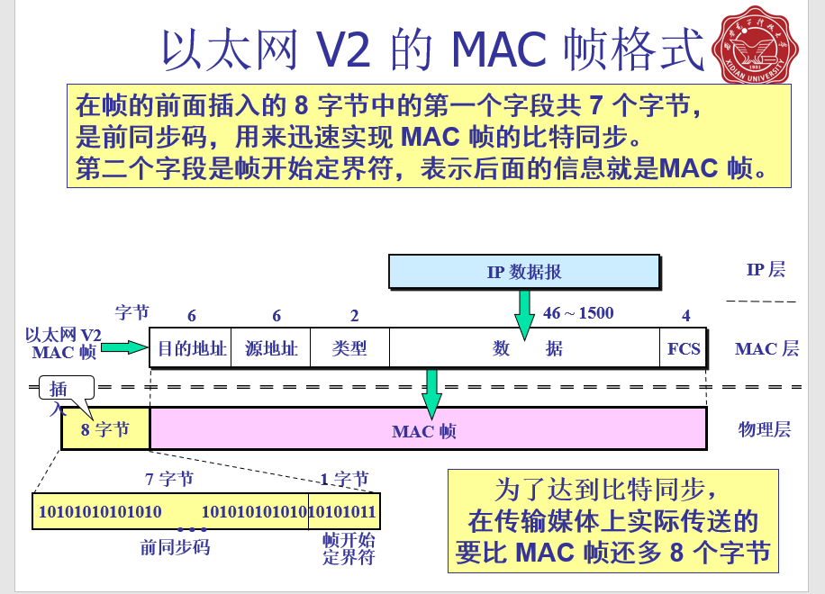
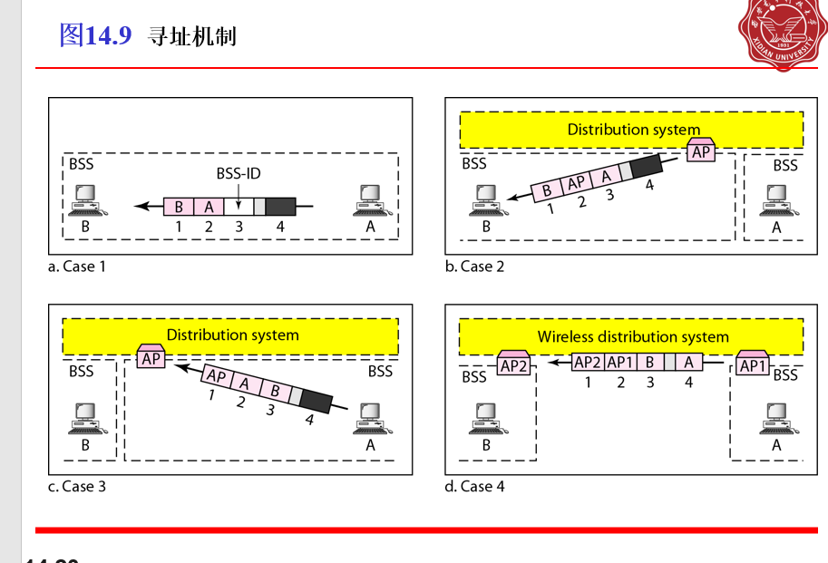

# Chapter 11 数据链路控制

## HDLC

数据链路层可以提供不可靠的传输, 也可以提供可靠的传输.

HDLC就是一种可靠的传输.

### HDLC帧

1. 标志(8位), 01111110, 为帧的开始标志.
2. 地址(8位)
3. 控制字(8位), 有三类：**信息帧, 监督帧, 无编号帧**
4. 信息, 长度任意
5. 帧检测序列, 16位
6. 结束标志

**PPP是面向字节的, HDLC是面向比特的**

# Chapter 12 多路访问

当一群东西共享介质的时候, 就需要点方法来控制这些东西说话.

控制多路访问的方法有三类:

1. 随机访问
   1. ALOHA
   2. CSMA
   3. CSMA/CD
   4. CSMA/CA(十四章)
2. 受控访问
   1. 预约
   2. 轮询
   3. 令牌
3. 通道化
   1. TDM
   2. FDM
   3. ...

## 随机访问

### ALOHA

#### 纯ALOHA协议

发, 发不出去就等 $$rand(0,2^k-1)*T$$ 再发, k++;(截断型二进制指数退让算法).

T可以是Tp或者Tfr.

可能冲突时间是$$ 2 \times T_{fr}$$

意思是在这一帧发之前的Tfr和开始发之后的Tfr内都有可能有人再发, 这时候发就会干扰这一帧.

吞吐量 $$S = Ge^{-2G}$$, $$G = \frac{1}{2}$$的时候取$$S_{max}$$

G是Tfr内系统产生帧的期望.

#### 时隙ALOHA协议

纯aloha协议太拉了, 就有时隙ALOHA协议, 时间被分成了离散的.

可能冲突时间少了一半, 只有Tfr

吞吐量  $$S = Ge^{-G}$$, $$G = 1$$的时候取$$S_{max}$$

### CSMA协议

CSMA全称是载波侦听多路访问, 意思就是在发之前他会探一下信道是否空闲.

CSMA常用有三种策略:

- 1-坚持型CSMA

  就是一直探, 能发就赶紧发, 不能发就一直探.

- p-坚持型CSMA

  一直探, 能发就以p的几率发, 否则就等一段固定的时间再探

- 非坚持型CSMA

  能发就发, 不能发就随机延迟(二进制啥玩意的方法延迟)

  

### CSMA/CD协议

带冲突检测的CSMA, 主要是CD部分.

还是一直探, 能发就发, 发的时候听, 如果发现自己发的和听的不一样, 就说明冲突了, 停下来, 随机延迟避让.

争用期/冲突窗口是$$ 2 \times \tau$$ , 意思是这段时间听不到错误不代表一定能不冲突地发出去. 但是过了这段时间, 就说明信道抢占成功, 一定能发出去了.

对于10M的以太网, 争用期规定为51.2us, 意思是只要把前512bits(64B)发送出去, 那以后就没人能干扰自己了. 

同时, 以太网的最小帧长也是这样来的, 64B.

要注意的是, 对于100M, 1000M的以太网, 最小帧长也是64B, 只不过把争用时间减少了, 同时最大的网线长度也减少了.

还有, 只有半双工的环境下需要CD, 全双工是不需要CD的.

##### 截断型二进制指数退让算法

先选个基本时间, 一般就是$$ 2\times \tau$$ .

然后k刚开始等于0, 碰撞一次就+1,

然后等待rand[0,M] * 基本时间, 其中

1. $$1 \leq N \leq 10, M = 2^{N}-1$$
2. $$10 \leq N \leq 15, M = 2^{10}-1 = 1023$$
3. $$N = 16, 直接扔了, 爬$$

## 受控访问

我感觉就考一个令牌.

### 令牌

就是网络是个圈, 有个特殊的帧在圈里转, 拿到了帧的才能发数据.

# Chapter 13 以太网

局域网是形容网络规模的, 以太网是在局域网中一中最受欢迎的解决方案.

局域网的控制方法主要有CSMA/CD, 令牌总线/令牌环. 前两种用于线性网, 最后一种用于环形网.

以太网有两个标准:

1. DIX Ethernet V2
2. 802.3

主要都用第一种, 第二种基本没人用了.

所以我大胆推测只考第一种.

注意, 数据链路层不提供重传, 以太网也是不可靠的. 但是这并不代表以太网一定不会重传. 以太网会在确定自己数据对面一定接收不到的时候重传, 例如CSMA/CD中数据都没发完, 那肯定要重传的. 但是当他不确定对方是不是没收到的时候, 他就不会重传, 所以他还是不可靠的.

## 以太网的MAC帧

同样的, 以太网还是根据标准不同有两种MAC帧, 主要只看V2版本的.

1. 前导码, 8Bytes, 这个是物理层加进去的, 前7B叫前同步码, 最后一个Byte叫帧开始定界符. MAC帧是不需要结束符的, 因为每一个帧都有开始符.
2. 目的地址, 源地址, 都是6Bytes.
3. 类型. 这个是说明这个帧交给上层哪个协议处理的, 例如IP数据包. 好像不重要.
4. 数据, 长度为46-1500Bytes. 46是因为一个帧最小64B, 减去18Bytes的其他东西, 这个东西至少46B. 1500是规定的, 记住就好. 如果不到46B, 就补成46B.
5. 校验码, 就是CRC. 校验了包括目的地址开始到数据结束的所有东西, 但是不包括前导码, 因为那个是物理层的哈哈.

802.3的格式与V2的区别:

1. 帧起始标志不一样.
2. 没有类型了, 改成了长度.

**以太网的MAC层提供的是无连接不可靠的服务**, 但不代表所有链路层的东西都是无连接不可靠的.

## 物理层

传统以太网主要有四种介质:

- 10Base5 (粗缆)
- 10Base2 (细缆)
- 10Base-F (Fiber 光纤)
- 10Base-T (T啥的 双绞线)

第一个数字表示速率, 第二个Base基带信号, 采用曼彻斯特编码.

后面的数字表示电缆最长距离, 500m/200m(实际上185m).

## MAC地址

MAC地址, 6个字节.

第一个字节最后一位表明单播还是组播.

最后一位是0是单播地址, 是1就是多播地址.

# Chapter 14 无线局域网

协议IEEE 802.11

还是定义了物理层和数据链路层.

BSS就是一小块连在一起的移动站和一个基站, BSS内部他们可以互相通信.

一个BSS可以是独立的, 也可以连到一个主干分配系统(DS)组成一个ESS.

ESS也可以通过门桥连到其他标准的局域网, 例如有线的因特网, 这里的门桥就相当于网桥.

## 两大问题

### 隐蔽站问题

A想发给B东西, A看没人发东西, 就给B发了, 但是另一个方向C也在给B发东西A看不到, 数据就坏了.

### 暴露站问题

A在发给B东西, 同时C也想给D发东西, 虽然A发的东西D接收不到, 但是C能接收到, 就不敢发, 浪费了时间.

这些问题决定了无线局域网不能使用CSMA/CD协议.

## CSMA/CA协议

带有碰撞避免的CSMA.

CSMA/CA主要有三个东西: 

帧间间隔(IFS), 竞争窗口和确认.

CSMA/CA有好多种帧间间隔, SIFS/PIFS/EIFS啥玩意的, 不同的东西发之前会等不同的IFS, SIFS是最短的, CTS/ACK什么玩意的之前就只等一个SIFS.

竞争窗口就是等完IFS之后,判断一下是否空闲, 然后类似二进制退让算法, 他会等R(随机的, 就是二进制退让算法那样随机)个slots, 每个slots之后都会判断信道是否空闲, 如果不空闲就卡住, 等空闲了继续从刚刚数到的位置继续数.

确认就是发送之后他还要确认, 如果超时了还没收到ACK, K++, 从等IFS之前再重来.

## RTS/CTS

为了解决隐蔽站问题, RTS/CTS方法可以选用:

A要发给B帧之前, 先发一个RTS, 让A旁边的傻逼们闭嘴.

B收到RTS之后, 再发一个CTS, 让B旁边的nt们小点声.

然后A和B就可以bb了.

## DCF/PCF

802.11的MAC层有两个子层, 下层是DCF, DCF之上有PCF.

DCF采用了CSMA/CA协议.

PCF在DCF之上实现, 采用轮询访问协议.

RTS/CTS是独立于他们的可选项, 与DCF/PCF好像无关.

## 帧格式

我感觉不考.

控制帧有三种:RTS/CTS/ACK帧

## 寻址机制

非常罕见的ppt说的我能听懂.

# Chapter 15 连接局域网主干网, 虚拟局域网

